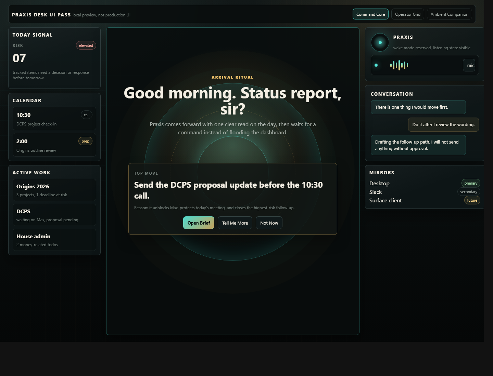
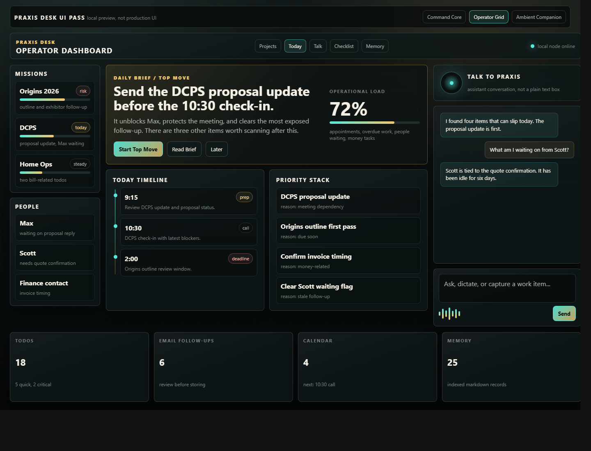
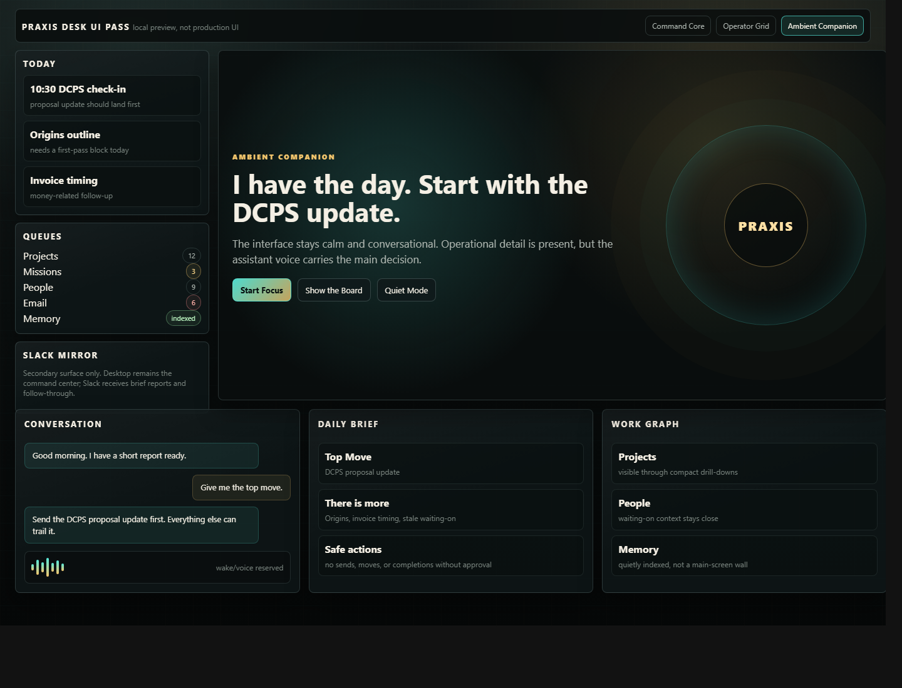

# Praxis UI Direction Options

These are concept directions only. No production UI changes have been made.

Local preview:

- `docs/ui-concepts/praxis-v1-directions-preview.html`
- `docs/ui-concepts/praxis-v1-command-core.html`
- `docs/ui-concepts/praxis-v1-operator-grid.html`
- `docs/ui-concepts/praxis-v1-ambient-companion.html`

## Direction 1: Command Core

Command Core makes the arrival ritual the product moment. Praxis appears as a central intelligence surface, asks for the status report, and presents one directive Top Move before the rest of the dashboard.

Best for:

- the strongest JARVIS-like personality
- wake phrase / arrival mode
- voice-first status report moments
- making Praxis feel like a resident assistant, not a form app

Tradeoffs:

- highest visual drama, but also the easiest to become tiring during normal work
- lower information density than an everyday operator console
- project, todo, memory, and follow-up queues need strong secondary drill-downs

## Direction 2: Operator Grid

Operator Grid keeps Today, Daily Brief, and Top Move as the center of gravity, with missions and people on the left, Talk to Praxis on the right, and compact secondary surfaces for todos, email follow-ups, calendar, and memory.

Best for:

- V1 daily usability
- fast scanning without burying the Top Move
- keeping Slack secondary while desktop remains the primary command surface
- reusing the current app structure and component boundaries
- future Surface/travel client panels because the layout is modular

Tradeoffs:

- less theatrical than Command Core
- needs a deliberate arrival overlay or intro state to create the wake-up moment
- the assistant conversation must be visually upgraded so the right rail does not feel like a plain text box

## Direction 3: Ambient Companion

Ambient Companion makes Praxis feel calmer and more personal. The assistant voice carries the main decision, while operational queues stay visible in softer supporting panels.

Best for:

- warm personal assistant tone
- conversation and future voice mode
- lower visual stress
- travel/companion-client scenarios where screen space is smaller or more casual

Tradeoffs:

- can hide too much operational detail for a serious desktop dashboard
- depends heavily on excellent drill-down behavior
- less suited as the first V1 layout because it underplays projects, todos, deadlines, and follow-ups

## Recommendation

Use Direction 2, Operator Grid, as the V1 foundation.

Borrow from Direction 1 for the wake-up / arrival moment:

- a short arrival state
- large greeting
- status report prompt
- Top Move before the detailed board

Borrow from Direction 3 for Talk to Praxis:

- assistant presence indicator
- conversational message bubbles
- voice/wake-word reservation area
- warmer, less form-like capture treatment

This gives Praxis the right V1 balance: serious enough to use every day, personal enough to feel like a local AI assistant, and modular enough for Slack mirror and future companion surfaces.

## Selected V1 Implementation

The operator chose Operator Grid for implementation on 2026-04-24.

Production UI direction:

- Daily Brief / Top Move is the primary center surface.
- Missions and People stay visible on the left as a work-graph rail.
- Talk to Praxis is the right rail with assistant presence, message bubbles, and a voice/wake-word affordance.
- Todos, money, waiting-on, projects, email, calendar, and memory stay visible through compact summary surfaces and existing drill-down/detail flows.
- Manual create forms remain available but are de-emphasized behind the assistant capture flow.
